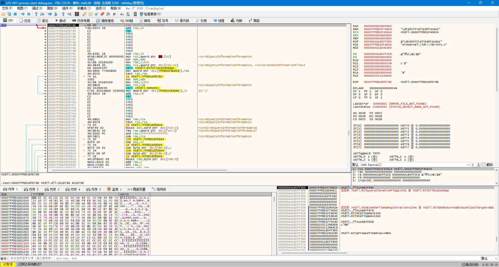
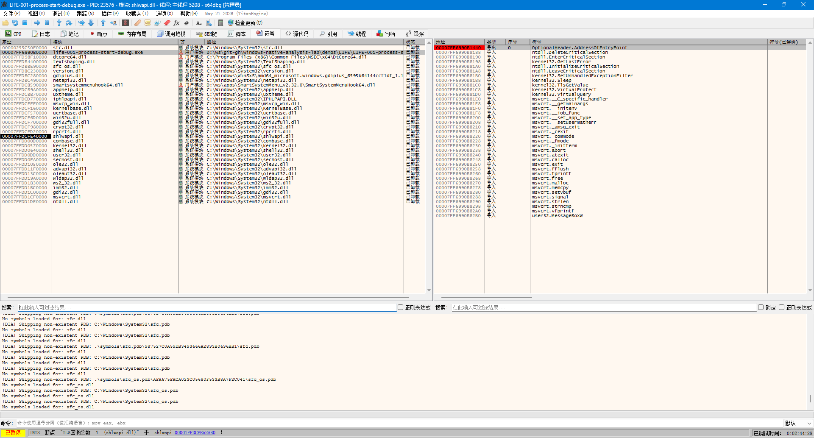
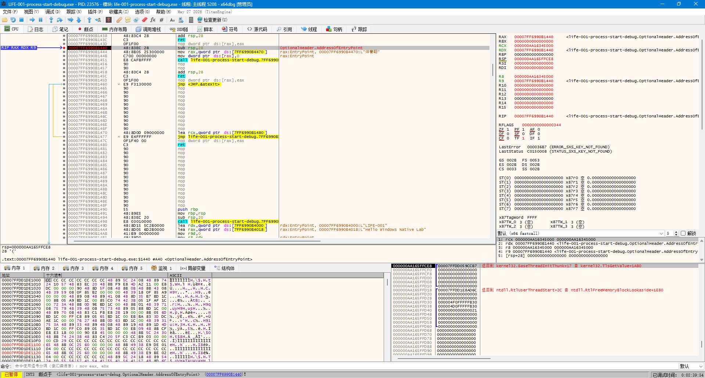
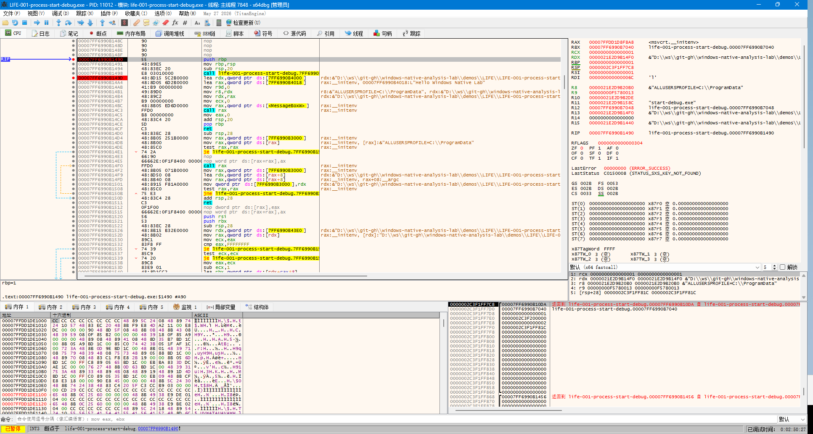
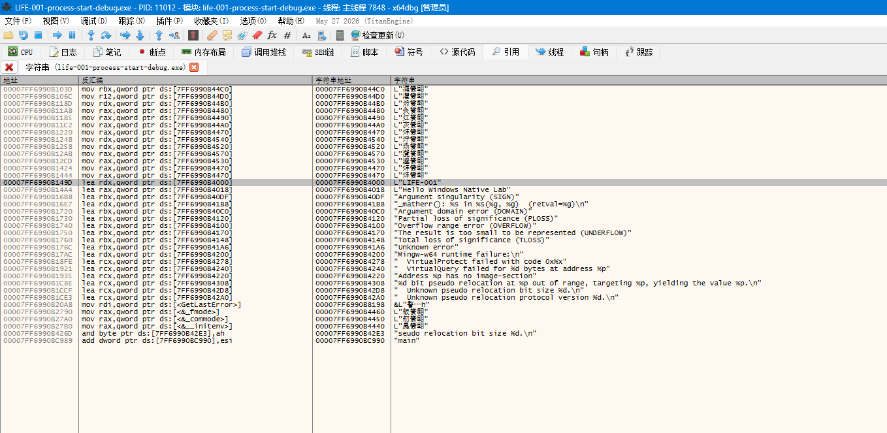
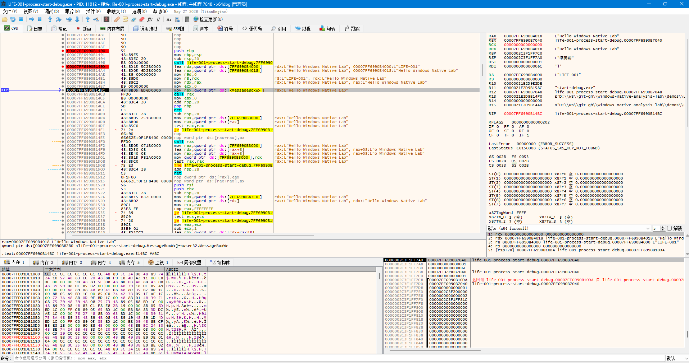
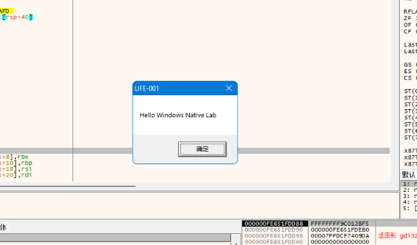

# LIFE-001-process-start Analysis Report

## 1. Experiment Information

### Demo

LIFE-001-process-start

### Purpose

观察 Windows 用户态程序启动过程。

通过 C++ 编写最小 Windows 程序，
使用 x64dbg 进行动态分析，理解：

- PE 加载流程
- EntryPoint
- CRT 初始化
- Win32 API 调用
- DLL 依赖关系

---

## 2. Environment

- Operating System: Windows
- Architecture: x86-64
- Compiler: MinGW-w64
- Toolchain: w64devkit 2.9.1
- Debugger: x64dbg

---

## 3. Program Overview

源码：

```cpp
int main()
{
    MessageBoxW(
        nullptr,
        L"Hello Windows Native Lab",
        L"LIFE-001",
        MB_OK
    );

    return 0;
}
```

实验目标：

通过一个最小 GUI 程序，观察从 EXE 加载到调用 Windows API 的完整流程。

---

## 4. Process Initialization Observation



程序加载后，x64dbg 初始停留于：

```
ntdll.dll
```

函数：

```
LdrpInitializeProcess
```

说明：

当前阶段属于 Windows Loader 初始化过程。

该位置由调试器加载流程触发，并非程序源码主动调用。

---

## 5. Loaded Modules



程序启动后加载的主要模块：

```
LIFE-001-process-start.exe
ntdll.dll
kernel32.dll
KernelBase.dll
user32.dll
gdi32.dll
ucrtbase.dll
msvcrt.dll
```

说明：

Windows 用户态程序运行时，除了自身 EXE 外，还依赖多个系统 DLL。

---

## 6. PE EntryPoint Analysis



PE Header:

```
OptionalHeader.AddressOfEntryPoint
```

观察结果：

```
VA:
0x7FF71AF81440
```

ImageBase:

```
0x7FF71AF80000
```

EntryPoint RVA:

```
0x1440
```

因此：

```
life-001-process-start.exe + 0x1440
```

---

## 7. EntryPoint 与 main 的区别

PE EntryPoint 不直接等于 main()。

实际流程：

```
Windows Loader

↓

PE EntryPoint

↓

MinGW CRT Startup

↓

main()

↓

Windows API
```

---

## 8. Function Identification





由于 MinGW-w64 生成程序未提供 PDB 符号，x64dbg 未显示源码函数名称。

通过行为分析识别函数：

```asm
push rbp
mov rbp,rsp
sub rsp,20
```

随后：

```asm
lea rdx, "Hello Windows Native Lab"
lea r8, "LIFE-001"
call MessageBoxW
```

根据：

- 字符串引用
- API 调用
- 控制流程

判断：

该函数对应源码中的：

```
main()
```

位置：

```
life-001-process-start.exe + 0x1490
```

---

## 9. Win32 API Call Analysis



调用：

```
user32.dll!MessageBoxW
```

Windows x64 参数：

| 参数 | 寄存器 |
| --- | --- |
| 第1个 | RCX |
| 第2个 | RDX |
| 第3个 | R8 |
| 第4个 | R9 |

对应：

```
RCX = nullptr
RDX = "Hello Windows Native Lab"
R8  = "LIFE-001"
R9  = MB_OK
```

---

## 10. Import Address Table (IAT)

观察到：

```asm
call qword ptr ds:[<MessageBoxW>]
```

而不是：

```asm
call user32.MessageBoxW
```

原因：

PE 文件通过 Import Address Table 保存外部函数地址。

调用流程：

```
LIFE-001.exe

↓

IAT

↓

user32.dll!MessageBoxW
```

IAT 是 DLL Hook、API Hook 的基础。

---

## 11. Symbol Analysis

x64dbg 已配置 Microsoft Symbol Server。

MinGW-w64 生成程序不提供 PDB 符号。

因此函数识别采用：

- API call
- String reference
- Control flow

---

## 12. Experiment Conclusion

验证流程：

```
Windows Loader

↓

ntdll.dll
LdrpInitializeProcess

↓

PE EntryPoint

↓

MinGW CRT Startup

↓

main()

↓

user32.dll!MessageBoxW
```

建立：

- Windows 用户态程序启动模型
- PE EntryPoint 理解
- DLL 依赖观察
- Win32 API 调用分析
- x64 调用约定理解
- 无符号程序分析方法

# 13. Experiment Result



实验程序成功执行。

最终观察到：

- Windows Loader 正常加载 PE
- 程序进入用户代码
- main 函数调用 MessageBoxW
- user32.dll 成功显示窗口

证明 LIFE-001 实验链路完整。