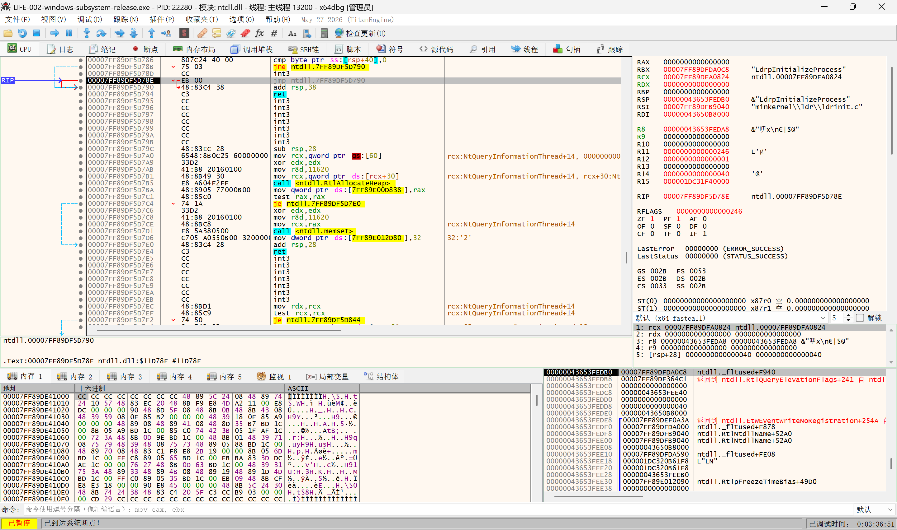
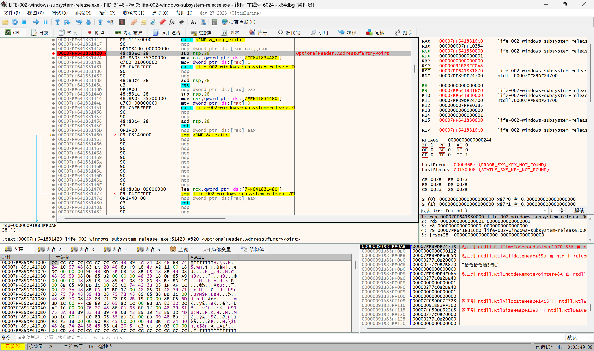
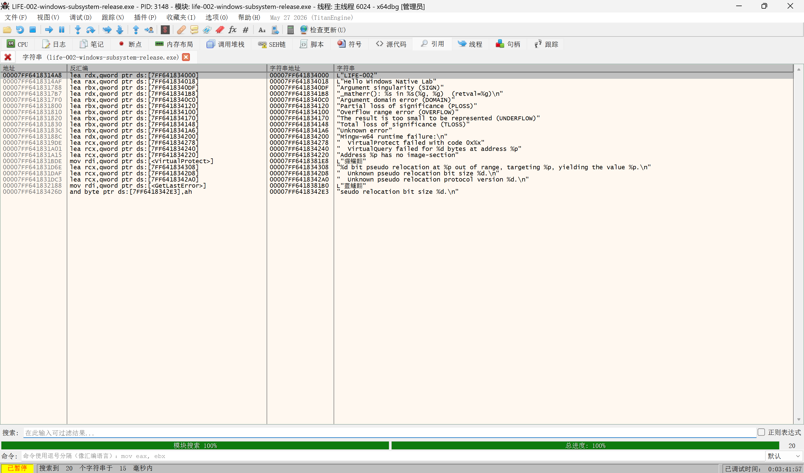
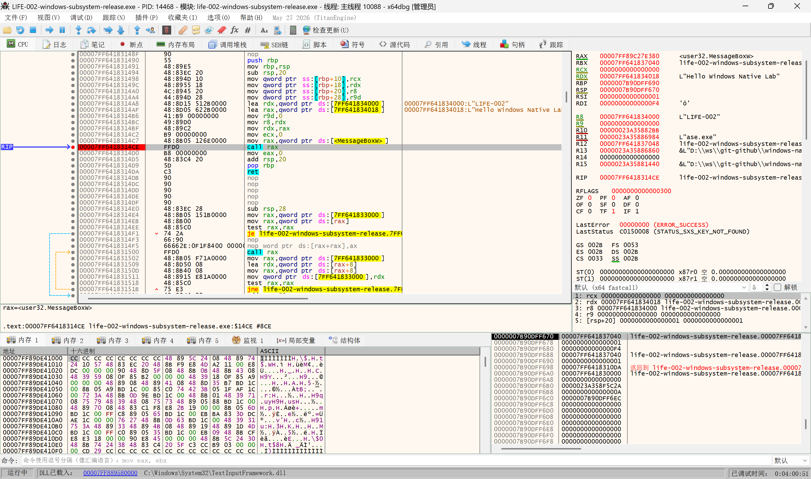
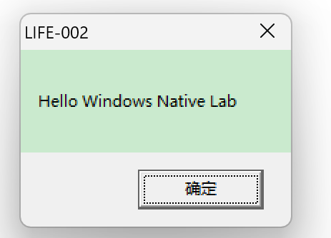

# LIFE-002-windows-subsystem Analysis Report

## 1. Experiment Information

### Demo

LIFE-002-windows-subsystem

### Purpose

观察 Windows GUI Subsystem 程序的启动过程，并与 LIFE-001 的 Console Subsystem 程序进行对照。

重点验证：

- `-mwindows` 对 PE `Subsystem` 的影响
- PE EntryPoint 与 `wWinMain` 的关系
- MinGW CRT Startup 与用户入口之间的关系
- 无符号环境下通过字符串引用定位用户逻辑的方法
- `MessageBoxW` 的调用方式和 Windows x64 参数传递

---

## 2. Environment

- Operating System: Windows
- Architecture: x86-64
- Compiler: MinGW-w64
- Toolchain: w64devkit 2.9.1
- Debugger: x64dbg
- Analysis Target: stripped release executable

---

## 3. Program Overview

源码：

```cpp
#include <windows.h>

int WINAPI wWinMain(
    HINSTANCE,
    HINSTANCE,
    PWSTR,
    int)
{
    MessageBoxW(
        nullptr,
        L"Hello Windows Native Lab",
        L"LIFE-002",
        MB_OK
    );

    return 0;
}
```

构建方式：

```text
wWinMain
+
-municode
+
-mwindows
+
MessageBoxW
```

本实验与 LIFE-001 的区别：

```text
LIFE-001
main
+
Console Subsystem
+
MessageBoxW

LIFE-002
wWinMain
+
Windows GUI Subsystem
+
MessageBoxW
```

需要注意：

> 能够显示窗口，不代表程序属于 Windows GUI Subsystem。

LIFE-001 虽然调用了 `MessageBoxW`，但其 PE Subsystem 为 Console。

LIFE-002 使用 `-mwindows` 构建，并通过 PE Header 验证其 Subsystem。

---

## 4. Loader Initial Observation



程序加载后，x64dbg 首先停留在 Windows Loader 初始化路径附近。

本次环境中观察位置位于：

```text
ntdll.dll
```

该位置属于调试器系统断点和 Loader 初始化阶段。

不同 Windows 版本、x64dbg 设置以及系统符号解析结果可能导致初始暂停位置不同，因此本实验不将某个具体 `Ldrp*` 内部函数作为固定启动入口。

结论：

```text
Windows Loader
    ↓
PE Image Loading
    ↓
Application EntryPoint
```

---

## 5. PE EntryPoint Analysis



x64dbg 可识别：

```text
OptionalHeader.AddressOfEntryPoint
```

记录本次运行：

```text
Loaded Base:
待填写

EntryPoint RVA:
待填写

EntryPoint VA:
待填写
```

关系：

```text
EntryPoint VA = Loaded Base + EntryPoint RVA
```

需要区分：

```text
Preferred ImageBase
```

与：

```text
Loaded Base
```

前者来自磁盘 PE Optional Header，后者是本次运行经过 ASLR 后实际映射的模块基址。

本实验确认：

```text
PE EntryPoint != wWinMain
```

PE EntryPoint 首先进入 MinGW CRT Startup，之后才进入用户入口逻辑。

---

## 6. PE Subsystem Analysis

本节使用 [`tmp.txt`](tmp.txt) 中保存的 `objdump` 输出作为静态证据：

```console
> objdump -p LIFE-002-windows-subsystem-release.exe | findstr /i subsystem
MajorSubsystemVersion   5
MinorSubsystemVersion   2
Subsystem               00000002        (Windows GUI)
```

作为对照，LIFE-001 的输出为：

```console
> objdump -p LIFE-001-process-start-release.exe | findstr /i subsystem
MajorSubsystemVersion   5
MinorSubsystemVersion   2
Subsystem               00000003        (Windows CUI)
```

本实验重点验证 PE Optional Header 中的：

```text
Subsystem
```

观察结果：

```text
Subsystem = 2
```

对应：

```text
IMAGE_SUBSYSTEM_WINDOWS_GUI
```

与 LIFE-001 对照：

| Demo | User Entry | PE Subsystem |
| --- | --- | --- |
| LIFE-001 | `main` | `IMAGE_SUBSYSTEM_WINDOWS_CUI` |
| LIFE-002 | `wWinMain` | `IMAGE_SUBSYSTEM_WINDOWS_GUI` |

因此：

> PE Subsystem 与程序是否调用 GUI API 是两个不同概念。

Console Subsystem 程序同样可以调用 `MessageBoxW`。

Windows GUI Subsystem 应通过 PE Header 中的 `Subsystem` 字段确认，而不是根据是否显示窗口进行判断。

---

## 7. String Reference Analysis



本实验正式分析对象使用 stripped Release 版本，不依赖源码函数符号。

通过 x64dbg 搜索程序中的字符串：

```text
"LIFE-002"
"Hello Windows Native Lab"
```

随后查看字符串引用，定位使用这些字符串的代码区域。

分析路径：

```text
String Reference
        ↓
Code Reference
        ↓
Function Identification
        ↓
API Call Analysis
```

这种方式不依赖 `main`、`wWinMain` 等源码函数名，更接近第三方无符号 EXE 的实际分析过程。

---

## 8. wWinMain Logic Identification



通过字符串引用进入相关代码区域后，可以观察到：

```asm
lea ..., "Hello Windows Native Lab"
lea ..., "LIFE-002"
...
call ... MessageBoxW
```

结合：

- 字符串引用
- 函数边界
- `MessageBoxW` 调用
- 上下文控制流

判断该代码区域对应源码中的 `wWinMain` 用户逻辑。

这里的结论属于基于行为和调用关系的识别，而不是依赖调试符号得到的函数名称。

更准确的表述是：

> 定位到对应 `wWinMain` 的用户逻辑区域。

本实验不深入分析完整 MinGW CRT Startup 内部实现，只确认：

```text
PE EntryPoint
    ↓
MinGW CRT Startup
    ↓
wWinMain user logic
```

---

## 9. Win32 API Call Analysis


观察到对：

```text
user32.dll!MessageBoxW
```

的调用。

Windows x64 调用约定中，前四个整数或指针参数通常通过：

| 参数 | 寄存器 |
| --- | --- |
| 第1个 | RCX |
| 第2个 | RDX |
| 第3个 | R8 |
| 第4个 | R9 |

传递。

在 `MessageBoxW` 调用前观察：

```text
RCX = nullptr
RDX = "Hello Windows Native Lab"
R8  = "LIFE-002"
R9  = MB_OK
```

对应源码：

```cpp
MessageBoxW(
    nullptr,
    L"Hello Windows Native Lab",
    L"LIFE-002",
    MB_OK
);
```

因此可以确认：

> Windows GUI Subsystem 不会改变普通 Win32 API 的 Windows x64 参数传递规则。

该行为与 LIFE-001 相同。

---

## 10. Experiment Result



程序成功执行并显示：

```text
Title:
LIFE-002

Content:
Hello Windows Native Lab
```

同时，程序本身没有创建 Console 窗口。

最终可见行为与 LIFE-001 都包含 `MessageBoxW`，但两者 PE Subsystem 不同。

---

## 11. LIFE-001 vs LIFE-002

| Item | LIFE-001 | LIFE-002 |
| --- | --- | --- |
| User Entry | `main` | `wWinMain` |
| Build Mode | default console | `-mwindows -municode` |
| PE Subsystem | WINDOWS_CUI | WINDOWS_GUI |
| PE EntryPoint | CRT Entry | CRT Entry |
| CRT Startup | Yes | Yes |
| `MessageBoxW` | Yes | Yes |
| x64 API ABI | RCX / RDX / R8 / R9 | RCX / RDX / R8 / R9 |
| Console Window | Console semantics | No Console window |

核心区别：

```text
相同：
MessageBoxW
Windows x64 ABI
PE EntryPoint → CRT → User Logic

不同：
PE Subsystem
main / wWinMain
Console / Windows GUI startup semantics
```

---

## 12. Evidence Level

本实验结论按照以下证据层级记录：

```text
Source Expectation
        ↓
PE Static Fact
        ↓
x64dbg Dynamic Observation
        ↓
Evidence-based Inference
```

具体包括：

### Source Expectation

源码声明：

```text
wWinMain
MessageBoxW
```

### PE Static Fact

PE Header 显示：

```text
Subsystem = IMAGE_SUBSYSTEM_WINDOWS_GUI
```

### Dynamic Observation

x64dbg 本次运行观察到：

```text
Loader
EntryPoint
String Reference
MessageBoxW Call
Register Arguments
```

### Inference

根据字符串引用、调用关系和程序行为，判断相关代码区域对应 `wWinMain` 用户逻辑。

---

## 13. Experiment Conclusion

本实验验证：

1. `-mwindows` 构建的程序 PE `Subsystem` 为 `IMAGE_SUBSYSTEM_WINDOWS_GUI`。
2. 调用 GUI API 并不能证明程序属于 Windows GUI Subsystem。
3. PE EntryPoint 不直接等于 `wWinMain`。
4. `wWinMain` 前仍然存在 MinGW CRT Startup。
5. 无符号环境下，可以通过字符串引用定位用户逻辑。
6. 分析路径可以采用：

```text
String Reference
        ↓
Function Identification
        ↓
API Call Analysis
```

7. `MessageBoxW` 在 LIFE-001 和 LIFE-002 中都遵循相同的 Windows x64 调用约定。
8. LIFE-001 与 LIFE-002 的主要区别位于 PE Subsystem 和用户入口语义，而不是 `MessageBoxW` 本身。

LIFE-001 与 LIFE-002 共同建立：

```text
Windows Loader
        ↓
PE EntryPoint
        ↓
CRT Startup
        ↓
User Entry Logic
        ↓
Win32 API
```

并验证 Console Subsystem 与 Windows GUI Subsystem 是 Windows 程序启动模型中的不同概念。
